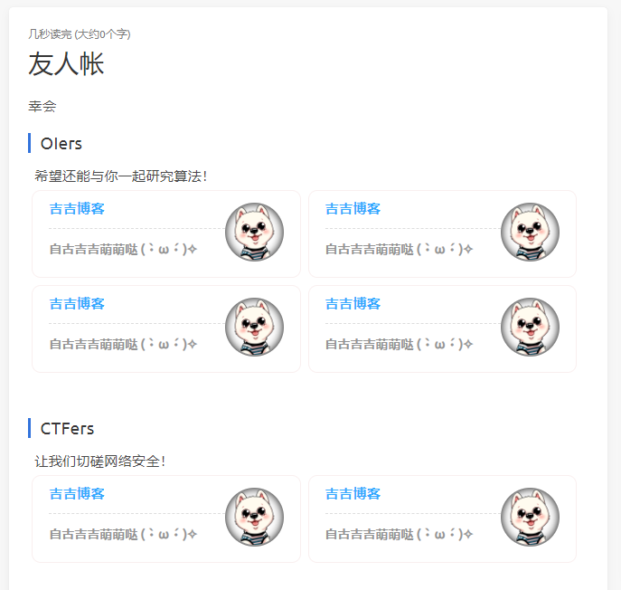

# hexo-friends

[](https://www.npmjs.com/package/hexo-friends)

## Preview



## Usage

Run the following command:
```bash
$ npm install hexo-friends --save
```

Add this to `_config.yml`:
```yml
friends:
  enable: true
  title: Friends
  description: This is an introduction
  path: friends/index.html
  data:
    - group: Group A
      description: The introduction of group A
      items:
        - name: Site 1
          url: https://example.com
          img: https://example.com/avatar.png
          description: The introduction of site 1
        - name: Site 2
          url: https://example.com
          img: https://example.com/avatar.png
          description: The introduction of site 2
    - group: Group B
      description: The introduction of group B
      items:
        - name: Site 1
          url: https://example.com
          img: https://example.com/avatar.png
          description: The introduction of site 1
```

After that, when you run `hexo generate`, the page will add `/friends/index.html` automatically.

## License

[GPL-3.0](LICENSE)
